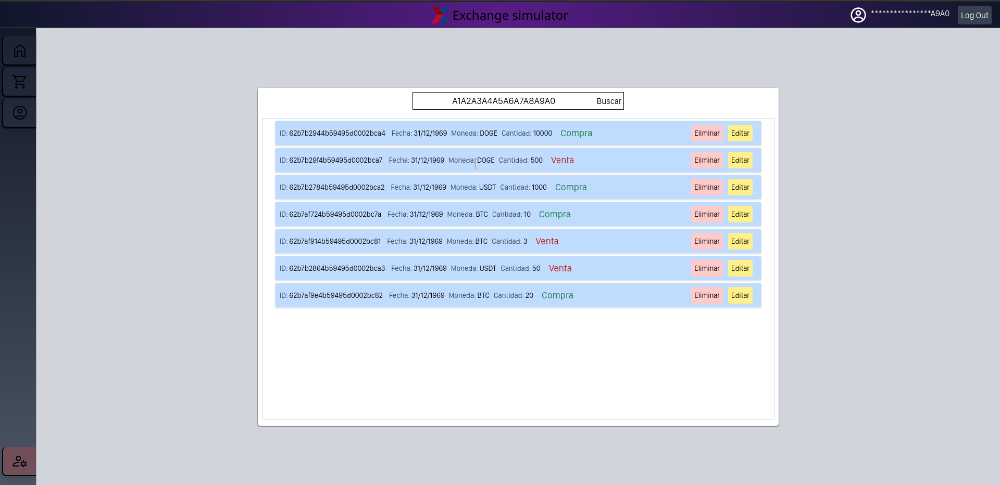

# Trabajo Final III - Laboratorio de Computación III

Trabajo practico final de Laboratorio de Computacion III. Consiste en un simulador de exchange con backend provisto por el profesor de la catedra.

## Simulador de Exchange o  billetera virtual.

### Funcionamiento técnico requerido

[Documentacion de requerimientos](https://docs.google.com/document/d/1UPcZnIubOcbx4_MhT0IkPoYo4yog4XFAQyYtLPwY9wY/edit?usp=sharing)

### Screenshot




***
### Tecnologías

Lista de tecnologías utilizadas en el proyecto:

* [Vite](https://vitejs.dev/): Versión 2.9.9 
* [Vue js](https://vuejs.org/): Versión 3.2.25 
* [Vue-Router](https://router.vuejs.org/): Versión 4 
* [Vuex](https://vuex.vuejs.org/): Versión 4.0.2 
* [Vue-Chartjs](https://vue-chartjs.org/): Versión 4.1.1 
* [Chart js](https://vue-chartjs.org/): Versión 3.8.0 
* [Axios](https://axios-http.com/docs/intro): Versión 0.27.2 
* [Tailwind CSS](https://tailwindcss.com/): Versión 3.0.24 
* [Post CSS](https://postcss.org/): Versión 8.4.14 
* [Autoprefixer](https://github.com/postcss/autoprefixer): Versión 10.4.7 
* [Node js](https://nodejs.org/es/): Versión 16.15.0

***
### Operatividad

Como instalar e inicializar el proyecto:
```
$ git clone https://github.com/FacuNBustos/Exchange-TrabajoFinal-lab3.git
$ yarn install
$ yarn run dev
```

Usuario utilizado en el desarrollo: A1A2A3A4A5A6A7A8A9A0
